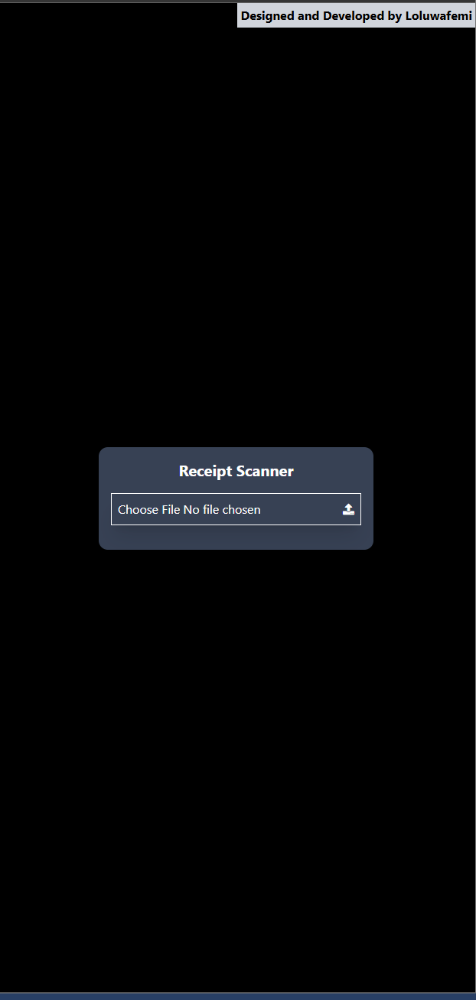
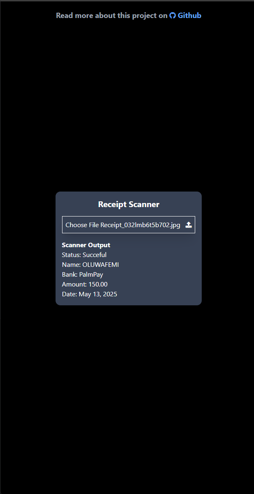

| First | Last |
|:--- |:--- |
|  |  |

### Start program
1. Create a virtual environment with:

    `python -m venv venv   `
2. Install Dependencies from requirements.txt

    `pip install -r requirements.txt`
3. Start Program

    `uvicorn main:app --reload`

    `source /home/nullwafemi/.virtualenvs/my_venv/bin/activate`

    `pa website delete --domain nullwafemi.pythonanywhere.com`