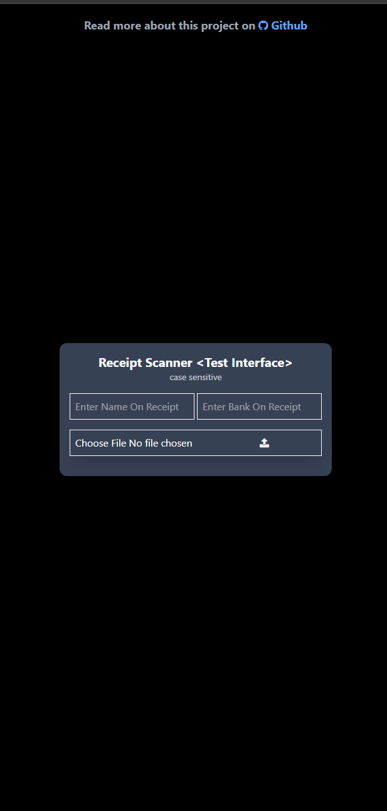

| First | Last |
|:--- |:--- |
|  |  |

### Start program
1. Create a virtual environment with:

    `python -m venv venv   `
2. Install Dependencies from requirements.txt

    `pip install -r requirements.txt`
3. Start Program

    `uvicorn main:app --reload`

4. Use application

### Using Docker
> Make sure docker/Docker Desktop is installed on your machine
1. Build Image: `docker build -t <image_name> .`

2. Run container: `docker run -d -p 8000:8000 <image_name>`

3. Or run container from docker desktop

4. Use application

> Note: The user interface will provide just 90% successful data as the [account name & bank name] is fixed. Kindly use the API `/extract_info` as follows.

#### API Structure:
    <!-- make sure you submit a form containing the following
    e.g file: the receipt image file from an input and must be an instance of a File class.
     -->
    const form = new FormData()
    form.append('file', file)
    form.append('name', <BANK ACCOUNT NAME>)
    form.append('bank', <BANK NAME>)

    fetch(base_url/extract_info, {
        body: form,
        method: "POST"
    })

    This returns an object or an error object if error is discovered when scanning,
    Possible error:
    - pytesseract not found on your machine
    - requirements and package incompatibilities on version

<!-- source /home/nullwafemi/.virtualenvs/my_venv/bin/activate -->

<!-- pa website delete --domain nullwafemi.pythonanywhere.com -->