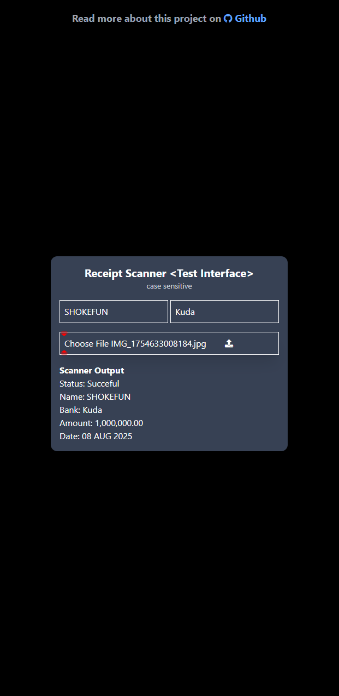

# Receipt Scanner

Receipt Scanner is a full-stack application designed to streamline the process of digitizing, organizing, and managing receipts. Built and maintained by a professional full-stack engineer, this project demonstrates expertise in software design, user experience, and modern development practices.

## Overview

Expense tracking and receipt management are essential tasks for individuals and organizations alike, yet they often remain manual and time-consuming. Receipt Scanner leverages the power of automation and intelligent data extraction to transform this tedious process into a seamless digital workflow.

## Key Features

- **Automated Receipt Capture:** Quickly scan or upload receipt images from any device.
- **OCR-Based Data Extraction:** Utilizes Optical Character Recognition (OCR) to extract key data such as date, name, amount, and bank name.
- **User-Friendly Interface:** Responsive, intuitive frontend built for ease-of-use across devices.

## Use Cases

- **Small Business Owners:** Simplify expense tracking and prepare for tax season with organized, searchable digital receipts.
- **Accountants & Finance Teams:** Streamline receipt collection and verification, reducing manual entry errors and time spent on reconciliations.
- **Individuals:** Maintain personal expense logs or track spending for budgeting and reimbursements.

## Why This Application is Useful

Managing paper receipts is inefficient, error-prone, and unsustainable in modern workflows. Receipt Scanner addresses these challenges by providing:

- **Efficiency:** Automates data entry and organization, freeing users from manual processes.
- **Accuracy:** Reduces human error through reliable OCR and structured data storage.
- **Accessibility:** Ensures receipts are always available, protected, and easily shareable.
- **Scalability:** Designed to handle growing data volumes and adapt to evolving business needs.

As a fullstack engineer, this project demonstrates a commitment to solving real-world problems with robust, scalable, and user-centric solutions. Receipt Scanner is not only a productivity tool but also a showcase of professional software engineering best practices.


| First | Last |
|:--- |:--- |
|  |  |


## Getting Started

1. **Clone the Repository**
   ```sh
   git clone https://github.com/Loluwafemi/receipt-scanner.git
   cd receipt-scanner
   ```

2. Create a python virtual environment with:

    `python -m venv venv`


3. Install dependencies from requirements.txt

    `pip install -r requirements.txt`


4. Start Program

    `uvicorn main:app --reload`

5.  **Access the App**
   - Navigate to `http://127.0.0.1:8000` in your browser.


### Using Docker
> Make sure docker/Docker Desktop is installed on your machine
1. Build Image: `docker build -t <image_name> .`

2. Run container: `docker run -d -p 8000:8000 <image_name>`

3. Or run container from docker desktop

4. **Access the App**
   - Navigate to `http://localhost:8000` in your browser.


> Note: The user interface will provide just 90% successful data as the [account name & bank name] is fixed. Kindly use the API `/extract_info` as follows.

#### API Structure:
    <!-- make sure you submit a form containing the following
    e.g file: the receipt image file from an input and must be an instance of a File class.
     -->
    const form = new FormData()
    form.append('file', file)
    form.append('name', <BANK ACCOUNT NAME>)
    form.append('bank', <BANK NAME>)

    fetch(base_url/extract_info, {
        body: form,
        method: "POST"
    })

    This returns an object or an error object if error is discovered when scanning,
    Possible error:
    - pytesseract not found on your machine
    - requirements and package incompatibilities on version


## Contributing

Pull requests and suggestions are welcome! Please see [CONTRIBUTING.md](CONTRIBUTING.md) for more information.


> This Receipt Scanner was developed to address a clear gap in efficient, reliable receipt management for an expense tracker <Figtrack>. In a world increasingly driven by digital transformation, the ability to automate, secure, and organize expense data is invaluable. This project not only solves a practical problem but exemplifies the best practices and technical depth expected from a modern fullstack engineer.


<!-- source /home/nullwafemi/.virtualenvs/my_venv/bin/activate -->

<!-- pa website delete --domain nullwafemi.pythonanywhere.com -->